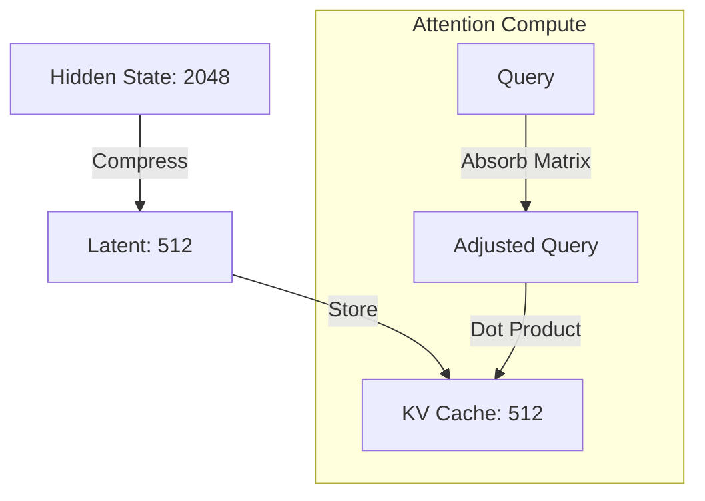

# Deep Dive: Multi-Head Latent Attention (MLA)

Multi-Head Latent Attention (MLA) is the "secret sauce" behind models like **DeepSeek V3** and **GLM-4.7-Flash**. On CPUs, where **Memory Bandwidth** is the primary bottleneck, MLA is a game-changer because it drastically reduces the size of the KV cache.

---

## 🏗️ The Mental Model: The Library Analogy

Imagine a massive library with **multi-lingual** librarians (Heads).

### ❌ Standard Attention (MHA):
- Every time a new book (Token) arrives, we make **128 different copies** (Heads) of its Summary (Key) and its Key Takeaways (Value).
- We store all 128 versions on the shelves (KV Cache).
- **Problem**: The shelves fill up instantly, and it takes forever to walk across the library to read them all (Memory Bandwidth bottleneck).

### ✅ Latent Attention (MLA):
- When a new book arrives, we write **ONE single, master summary** in a "universal language" (the **Latent Vector**, typically 512 dimensions).
- We store only this *one* summary on the shelf.
- **The Magic**: When a librarian (Head) needs to read it, they have a "translation guide" (Up-Projection matrix) to turn that 512-dim summary into the specific 128-dim version they need for their language *instantly in their head*.
- **Benefit**: Shelves are **20x - 30x smaller**. You only visit the shelf once per token, not 128 times.

---

## 🔧 Dimensions: From 2048 to 512

In `GLM-4.7-Flash` (and DeepSeek-V3), here's how the math works:

1. **Input**: A token with 2048 numbers (Hidden State).
2. **Compress**: We squash that 2048 into a **512-dim Latent Vector** ($kv\_c$).
3. **KV Cache**: We store only the **512** numbers.
4. **Attention Time**: We use matrices to "expand" that 512 into:
   - **Keys**: 20 heads × 192 dimensions = 3840 numbers.
   - **Values**: 20 heads × 256 dimensions = 5120 numbers.

**Memory Savings**: Instead of storing 8,960 numbers per token, we store **512**. That's a **~17.5x compression!**

---

## 🪄 The "Absorption Trick"

You might think: *"If we expand 512 into 8,960 during attention anyway, don't we still have to do all that work?"*

**No!** Because of linear algebra:
$Query \times (Latent \times ExpansionMatrix) = (Query \times ExpansionMatrix) \times Latent$

We can **absorb** the expansion matrix into the Query *before* we even look at the KV cache.
- We pre-multiply the Query by the expansion matrix.
- Now the Query is "looking" for the latent vector directly.
- We do attention directly on the compressed 512-dim vector.

**This is what makes MLA so fast on CPU**: We stream 512-dim vectors from RAM, not 8,960-dim vectors.

---

## � Technical Deep Dive: Tensor Shapes

In a standard model (like Llama 3), for every token, we store `Heads * Head_Dim` for Keys and Values. For MLA, we store a single **Latent Vector**.

### 1. The Compression (KV-side)
When a token $h_t$ (shape: `[2048]`) enters the attention layer:
1.  **Project to Latent**: $kv\_c = h_t \times W_{dkv}$ 
    *   Shape: `[2048] -> [512]`
2.  **ROPE Branch**: $k_{pe} = h_t \times W_{kr}$ 
    *   Shape: `[2048] -> [64]` (This is for the shared RoPE)
3.  **Stored in Cache**: We store the concatenation $[kv\_c, k_{pe}]$.
    *   **Total Cache Size**: **576** numbers.

### 2. The Absorption Trick (The Math MAGIC)
In traditional Multi-Head Attention, the attention score $A$ is:
$$A = (Q \times W_{uq}) \times (kv\_c \times W_{uk})^T$$
*(Where $W_{uq}$ and $W_{uk}$ expand the vectors into multi-head dimensions).*

By the **Associative Property** of Matrix Multiplication:
$$A = Q \times (W_{uq} \times W_{uk}^T) \times kv\_c^T$$

**The "Trick"**: Instead of expanding the $kv\_c$ from 512 to 16,384 (128 heads $\times$ 128 dim) in RAM, we pre-multiply the Query by a combined matrix $W_{combined} = (W_{uq} \times W_{uk}^T)$. 

**Result**: We do the math on small 512-dim vectors.

---

## 🛠️ Toy Example (PyTorch)

Here is a simplified version of the logic found in [vllm/model_executor/layers/mla.py](vllm-cpu/vllm/model_executor/layers/mla.py).

```python
import torch
import torch.nn.functional as F

# Configuration
batch, n_heads, config_latent, virtual_dim = 1, 128, 512, 128

# 1. THE KV CACHE (Compressed)
# Instead of storing [1, 128, 128], we store [1, 512]
kv_latent = torch.randn(batch, 1, config_latent) 

# 2. THE QUERY (Absorbed)
# We expand the query to look for the latent space directly
q_absorbed = torch.randn(batch, n_heads, config_latent) 

# 3. THE ATTENTION
# We compute attention directly on the latent space!
# (batch, n_heads, 1) @ (batch, 1, 512).T -> scores
attn_weights = torch.matmul(q_absorbed, kv_latent.transpose(-1, -2))
attn_weights = F.softmax(attn_weights / 8.0, dim=-1)

# 4. THE OUTPUT (V-Projection)
# We multiply weights by latent, then project back to heads
# This is essentially Multi-Query Attention at the cache level, 
# but Multi-Head Attention at the compute level.
context = torch.matmul(attn_weights, kv_latent) # [batch, n_heads, latent]
```

---

## �🗺️ The Architecture Map


